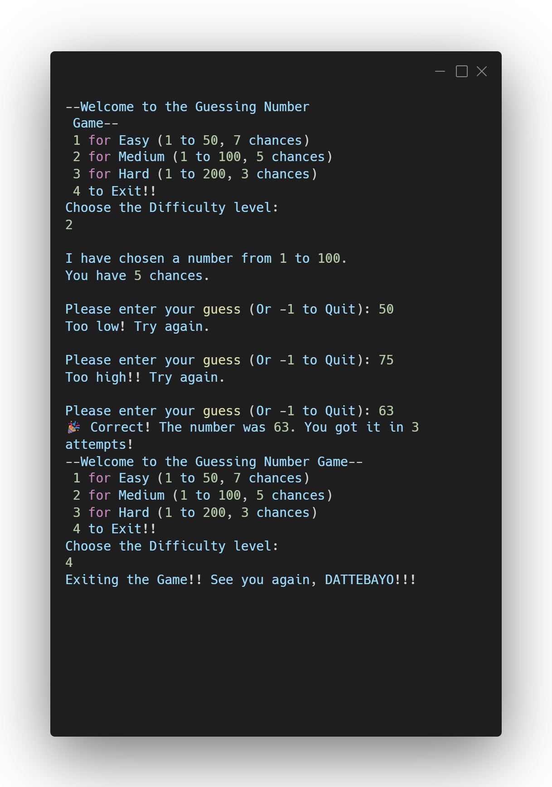

# 🔢 Number Guessing Game

A fun and interactive command-line game built in C. This project demonstrates control flow, user input handling, and random number generation, featuring multiple difficulty levels and a custom menu system.

## 📸 Preview

## 🎮 How to Play
1. Run the game and select a difficulty level:
   * **Easy:** 1 to 50 (7 chances)
   * **Medium:** 1 to 100 (5 chances)
   * **Hard:** 1 to 200 (3 chances)
   * **Exit:** Leaves the game entirely.
2. The program generates a random number within your chosen range.
3. Enter your guess! If you want to exit a round early, simply type `-1`.
4. The game will provide hints if your guess is "Too high" or "Too low".
5. Guess the correct number before running out of attempts to win!

## 🚀 Key Learning Concepts
* **Random Number Generation:** Utilizing `rand()` and `srand(time(NULL))` to ensure a unique secret number every session.
* **Control Flow:** Combining `do-while` and `while` loops to manage the main menu state and the individual round attempts.
* **Switch Statements:** Efficiently routing user choices for the difficulty menu.
* **Break & Continue Logic:** Safely handling loop exits when a user wins, loses, or chooses to quit early.

