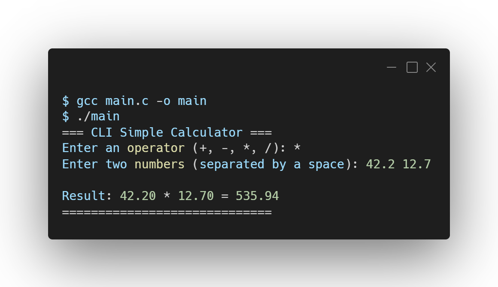

# 🧮 Simple CLI Calculator

A lightweight, command-line interface (CLI) calculator written in C. This is **Project 02** in my journey to build 10 foundational C programs. 

It takes user input for basic arithmetic operations and safely handles edge cases like division by zero.

## 🛠️ Tech Stack
<a href="https://skillicons.dev">
  
</a>

## 📸 Output Preview

<p align="left">
  
</p>

## 🧠 Concepts Covered
This project reinforces core computer science fundamentals, including:
* **Control Flow:** Using `switch` cases for menu selection.
* **Variable Types:** Managing floating-point precision using `double`.
* **User I/O:** Using `scanf` and `printf` for clean terminal interaction.
* **Error Handling:** Preventing crashes by validating data (e.g., blocking division by zero).

## 🚀 How to Run

1. Clone this repository to your local machine.
2. Open your terminal and navigate to this project folder.
3. Compile the C code using GCC:
   ```bash
   gcc main.c -o calculator