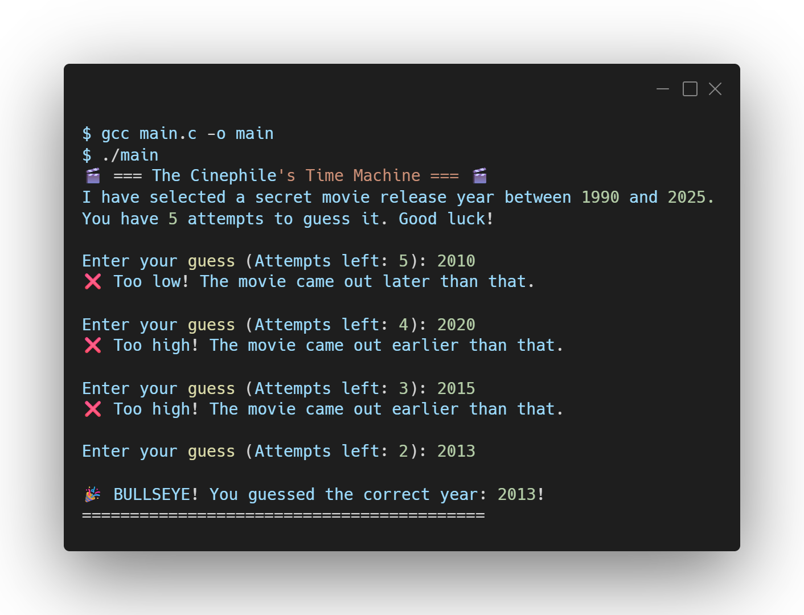

# 🎬 Movie Release Year Guesser

A command-line number guessing game written in C. This is **Project 03** in my 10-project foundation series.

The program generates a pseudo-random movie release year between 1990 and 2025, and the user must guess it within 5 attempts using higher/lower hints.

## 🛠️ Tech Stack
<p align="left">
  <a href="https://skillicons.dev">
    
  </a>
</p>

## 📸 Output Preview

<p align="left">
  
</p>

## 🧠 Concepts Covered
* **Pseudo-Random Number Generation:** Using `rand()` and seeding with `srand(time(NULL))`.
* **Game Loops:** Utilizing `while` loops to maintain the game state until a win or loss condition is met.
* **Flow Control:** Using `break` to exit loops early upon a successful guess.
* **Conditional Logic:** Guiding the user with nested `if-else` statements.

## 🚀 How to Run

1. Clone this repository to your local machine.
2. Compile the C code using GCC:
   ```bash
   gcc main.c -o guesser