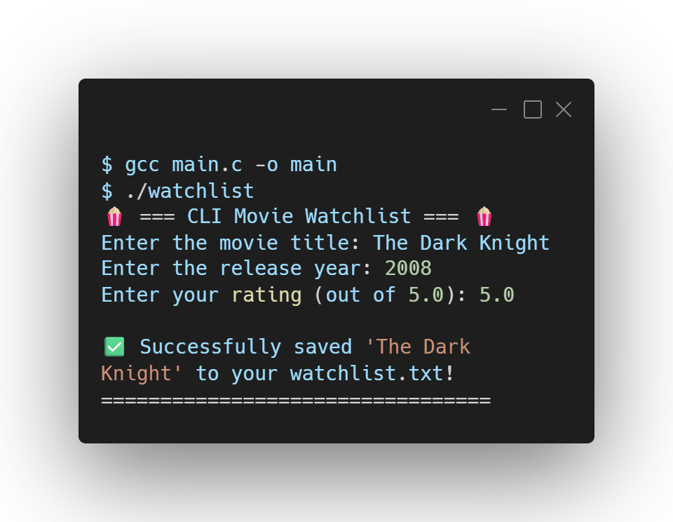

# 🍿 CLI Movie Watchlist

A terminal-based movie tracker written in C that introduces persistent storage. 

This program allows a user to input a movie title, release year, and a rating, grouping the data using `structs` and permanently saving it to a local text file using file handling.

## 🛠️ Tech Stack
<p align="left">
  <a href="https://skillicons.dev">
    
  </a>
</p>

## 📸 Output Preview

<p align="left">
  
</p>

## 🧠 Concepts Covered
* **Structures (`struct`):** Grouping distinct data types (strings, integers, floats) into a single logical entity.
* **File Handling:** Utilizing `FILE` pointers, opening files in Append (`"a"`) mode to preserve historical data, and writing to the disk using `fprintf`.
* **String Manipulation:** Using `fgets` to capture string inputs with spaces.
* **Repository Management:** Utilizing a `.gitignore` file to safely exclude the generated database from version control.

## 🚀 How to Run

1. Clone this repository to your local machine.
2. Compile the C code using GCC:
   ```bash
   gcc main.c -o watchlist