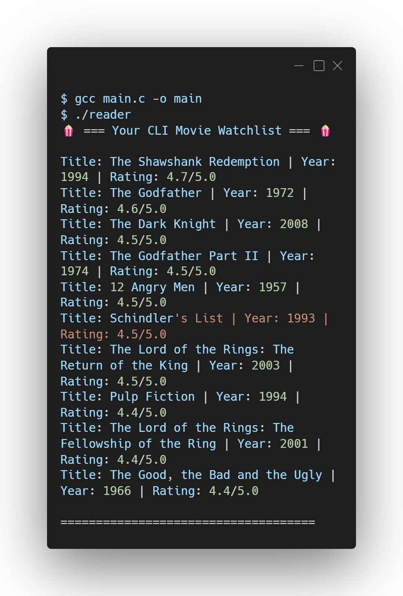

# 📖 CLI Watchlist Reader

A terminal-based file reading utility written in C. This program completes the core file handling loop by reading a local `watchlist.txt` database and dynamically printing the stored movie records back to the terminal.

## 🛠️ Tech Stack
<p align="left">
  <a href="https://skillicons.dev">
    
  </a>
</p>

## 📸 Output Preview

<p align="left">
  
</p>

## 🧠 Concepts Covered
* **File Reading (`"r"` mode):** Safely opening existing text files without overwriting data.
* **Buffer Arrays:** Using `char` arrays to temporarily store data pulled from the hard drive.
* **The EOF Loop:** Utilizing `while` loops combined with `fgets()` to read an unknown amount of lines until the End of File is reached.
* **Pointer Validation:** Enforcing `NULL` checks on `FILE *` pointers to prevent runtime segmentation faults.

## 🚀 How to Run

1. Clone this repository to your local machine.
2. Ensure you have a `watchlist.txt` file in the same directory (generate one using the CLI Movie Watchlist project).
3. Compile the C code using GCC:
   ```bash
   gcc main.c -o reader