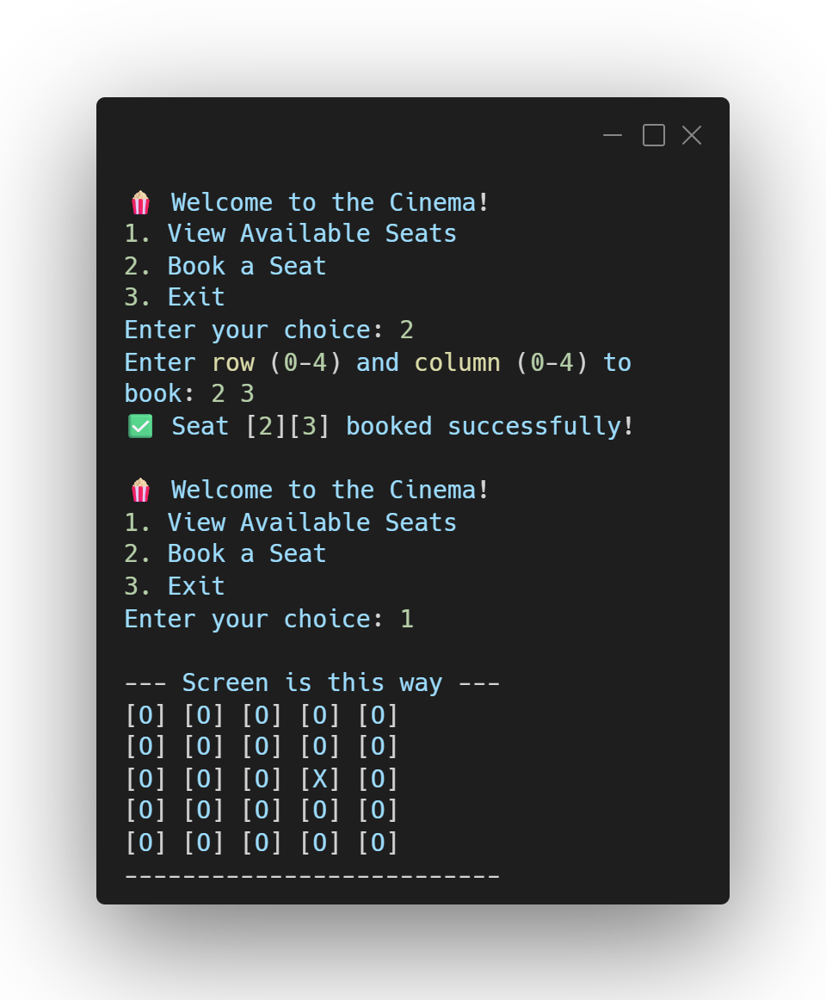

  
# 🎬 Cinema Ticket System

**A command-line seat booking application built in C.**

---

## 📸 Preview

  

---

## 🚀 About the Project

This project simulates a movie theater booking system where users can view available seats and book them in real-time. It relies on 2D arrays to map out the theater grid and updates the state of each seat dynamically.

## 🧠 Concepts Practiced

* **2D Arrays:** Matrix traversal for the seating grid.
* **Control Flow:** Loops & Conditional Logic.
* **State Management:** Tracking `O` for Open and `X` for Booked.

