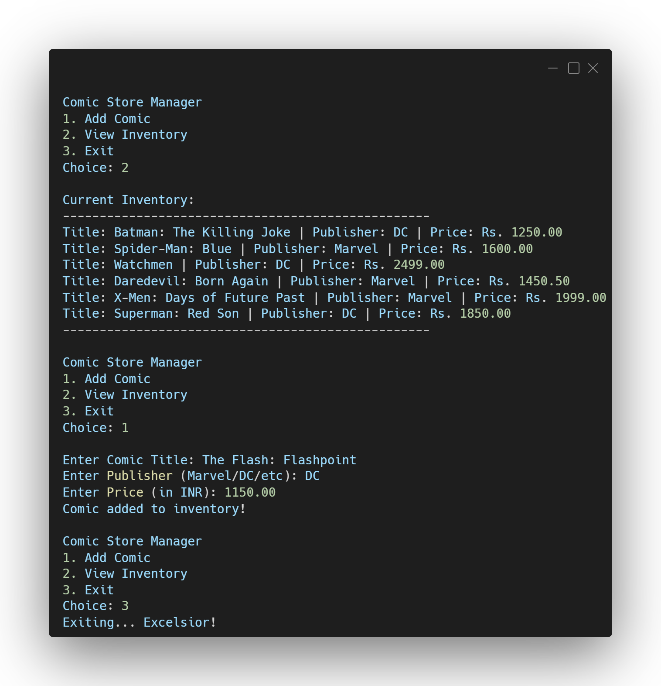

  
# 🦸 Comic Book Inventory Manager

**A CRUD command-line tool for managing a comic book store inventory built in C.**

---

## 📸 Preview

  

---

## 🚀 About the Project

This program allows a user to create, read, and manage a digital inventory of comic books. It takes user input for titles, publishers, and prices, and permanently saves them to an external text file (`comics.txt`). It serves as a practical demonstration of integrating C with external file systems.

## 🧠 Concepts Practiced

* **Structures (`struct`):** Creating custom data types to group related comic attributes together.
* **File Handling:** Using `fopen`, `fprintf`, and `fgets` in both append and read modes to ensure data persistence.
* **String Manipulation:** Safely handling multi-word user inputs (like comic titles with spaces) using formatted `scanf`.