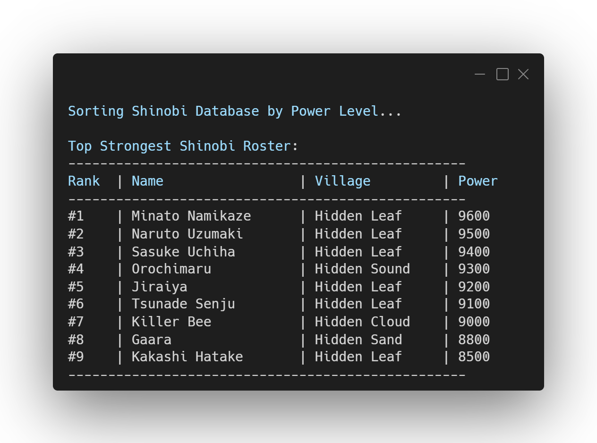

  
# 🍃 Shinobi Database Sorter

**A terminal-based sorting algorithm visualizer using character data.**

---

## 📸 Preview

  

---

## 🚀 About the Project

This program loads an array of character structures and uses a Bubble Sort algorithm to rank them based on their raw power levels in descending order. It outputs the final sorted roster in a cleanly formatted terminal table.

## 🧠 Concepts Practiced

* **Arrays of Structures:** Managing multiple related datasets simultaneously.
* **Sorting Algorithms:** Implementing standard Bubble Sort logic.
* **Memory Handling:** Swapping complex data types (entire `structs`) efficiently.
* **Formatted Output:** Using advanced `printf` formatting (e.g., `%-20s`) for clean UI.

