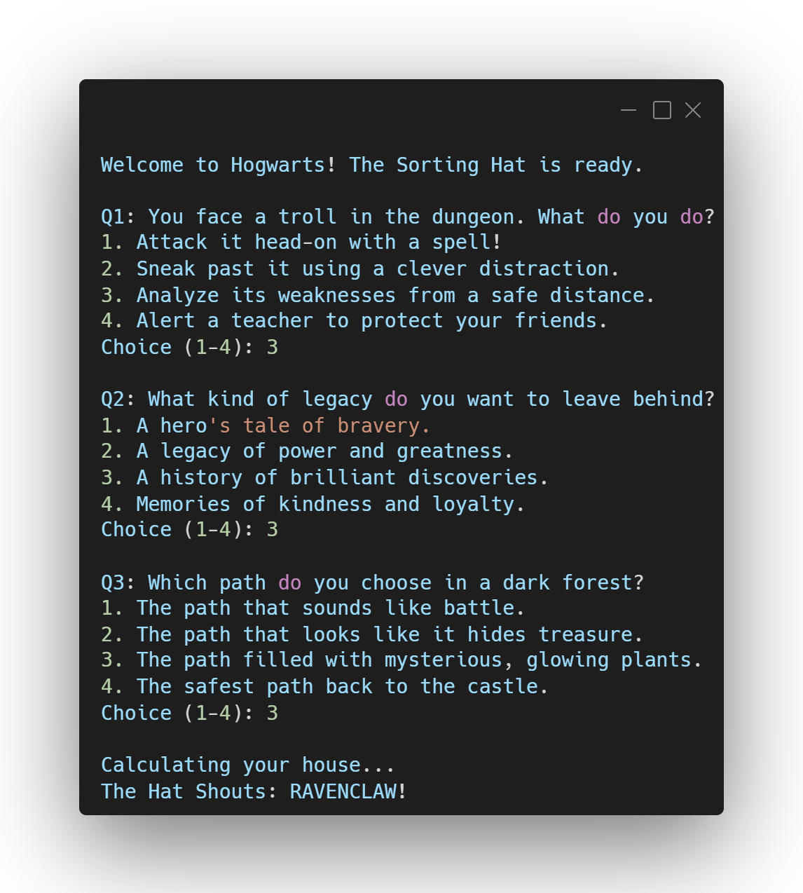

  
# 🧙 Hogwarts Sorting Hat

**An interactive, logic-based personality quiz built in C.**

---

## 📸 Preview

  

---

## 🚀 About the Project

This program is a command-line personality quiz. It asks the user a series of situational questions, tallies their scores internally using a weighted point system for each of the four Hogwarts houses, and sorts them into their rightful house based on the final highest variable.

## 🧠 Concepts Practiced

* **Complex Branching:** Nested `if/else` and `switch` statements for decision-making.
* **Algorithm Design:** Incrementing scoring logic based on user choices.
* **Input Validation:** Taking integer input and using it to mutate program state.

