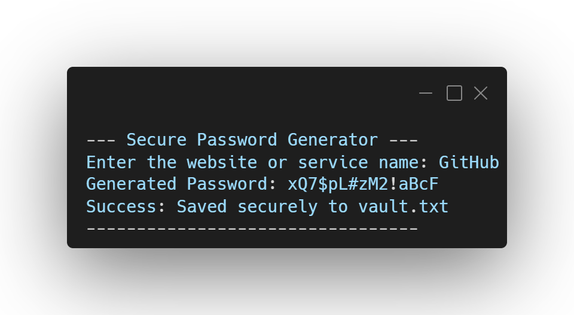

  
# 🔐 CLI Password Manager

**A lightweight utility that generates strong, randomized passwords.**

---

## 📸 Preview

  

---

## 🚀 About the Project

This tool creates a secure 16-character alphanumeric string (including special characters) based on a random seed, and appends it directly to a local text file (`vault.txt`) alongside the website or service name. It is a practical utility program built entirely in C.

## 🧠 Concepts Practiced

* **Random Number Generation:** Using `srand()`, `rand()`, and `time()` to create unpredictable outputs.
* **String Construction:** Generating arrays of characters and proper termination (`\0`).
* **File Appending:** Safely storing generated data using `fopen` in append mode (`"a"`) without overwriting existing entries.

