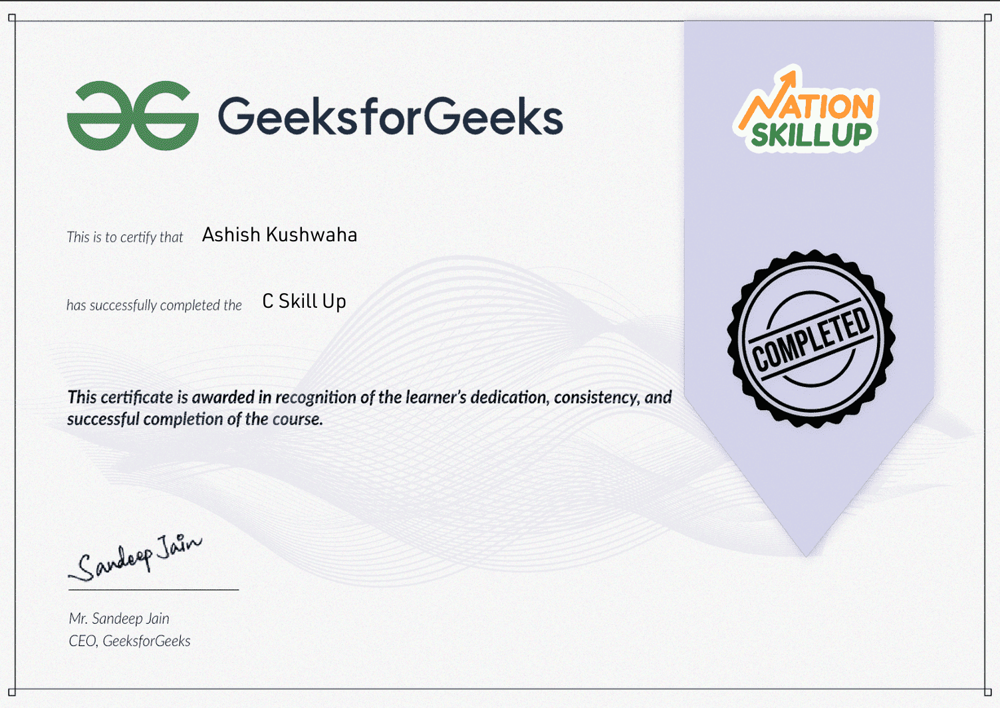

# 💻 C Programming Projects Portfolio

Welcome to my C programming portfolio! This repository contains a growing collection of command-line applications and games built entirely in C. 

## 🎯 Motivation & Background

I have completed my core learning of C programming by studying documentation from **GeeksforGeeks**, earning a certification from **National Skill Up**, and following tutorials from the **Bro Code** YouTube channel. 

The primary goal of building these projects is to test my logic, solidify my understanding of C, and thoroughly revise these core concepts. Building these from scratch serves as my final practice ground before I transition to learning my next programming languages, like JavaScript.

### 🏆 Certification

## 🗂️ Project Directory

Here are the projects currently included in this repository. Each project resides in its own folder with a dedicated README explaining its specific mechanics, complete with screenshots and previews of the program in action.

- [x] **01. Number Guessing Game:** A classic game utilizing random number generation and basic loop structures.
- [x] **02. Simple Calculator:** A utility tool demonstrating `switch` cases and basic arithmetic operations.
- [x] **03. Movie Year Guesser:** A command-line game utilizing pseudo-random number generation and `while` loops.
- [ ] **04. CLI Movie Watchlist:** A terminal-based tracker introducing `structs` and File Handling. *(Coming Soon)*

*(Note: Checkboxes will be ticked as projects are completed and uploaded. More projects may be added to this list over time!)*

## 🛠️ General Setup and Compilation

To compile and run any of these projects locally, you will need a C compiler like GCC. 
